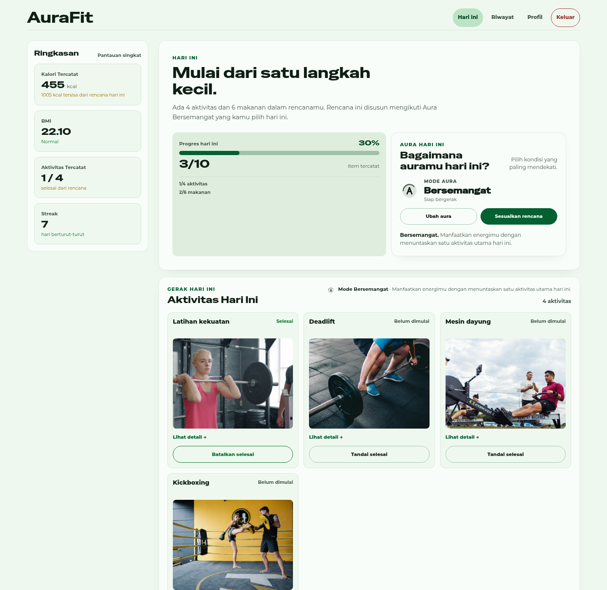
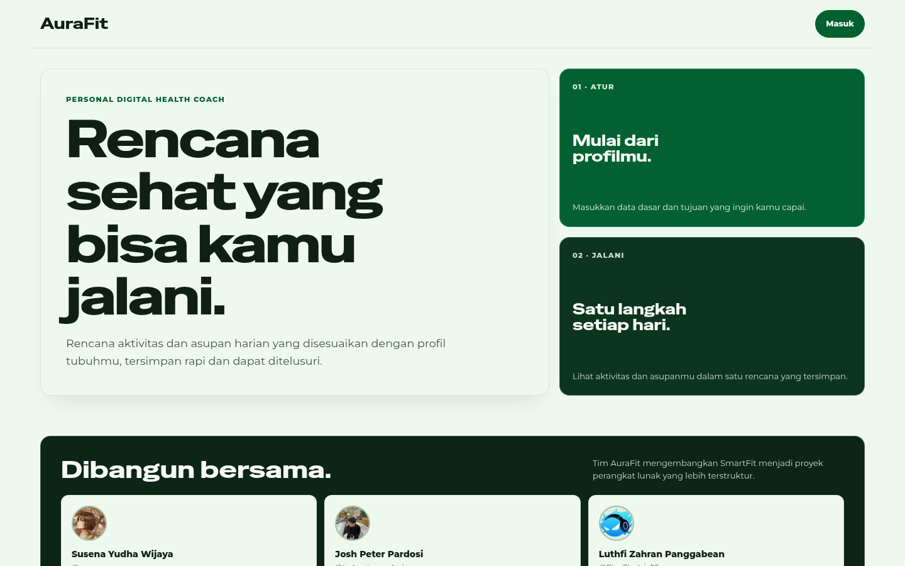
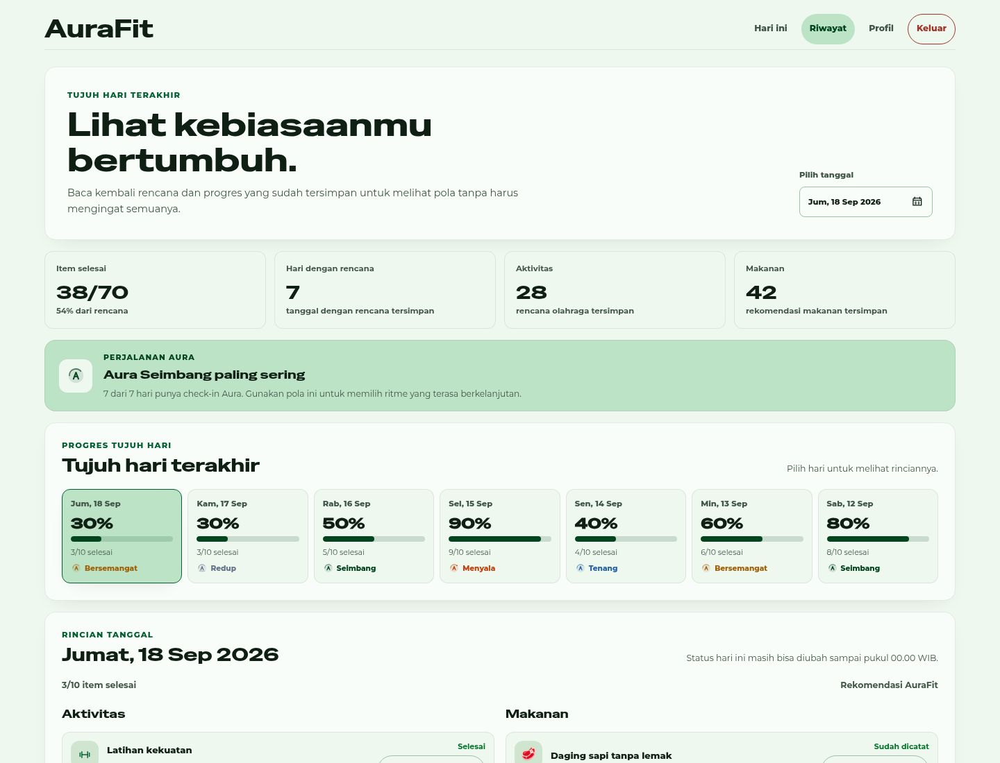
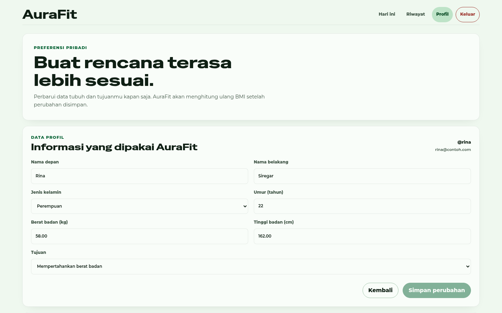
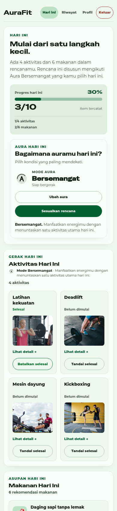

# AuraFit - Pelatih Kesehatan Digital Pribadi Anda



## Deskripsi Singkat
AuraFit adalah aplikasi web yang menyusun rencana aktivitas dan makanan harian dari data tubuh, tujuan, dan **aura** pengguna, yaitu kondisi energi yang dipilih setiap hari. Rencana, progres, dan riwayat disimpan di server sehingga tetap sama ketika akun dibuka dari perangkat berbeda.

Antarmuka dibangun dengan React, Vite, dan Tailwind CSS, layanan aplikasi dengan Express, dan data disimpan di PostgreSQL.

## Tampilan

| Beranda | Riwayat |
|---|---|
|  |  |
| **Profil** | **Hari ini di ponsel** |
|  |  |

## Fitur Utama

* **Aura harian:** pengguna memilih kondisi energi (redup sampai menyala), lalu intensitas rencana bergeser satu tingkat mengikuti aura tersebut.
* **Rencana harian otomatis:** empat aktivitas dan enam makanan disusun dari kategori BMI dan tujuan, disimpan sekali per hari dan tidak berubah saat dibuka ulang.
* **Rencana manual:** pengguna dapat menambah, mengubah, dan menghapus butir sendiri.
* **Pencatatan progres:** butir ditandai selesai dan dapat dibatalkan pada hari yang sama; hari yang sudah lewat terkunci.
* **Riwayat dan streak:** ringkasan tujuh hari dengan bar progres per hari, serta streak yang dihitung dari hari dengan minimal satu aktivitas selesai.
* **Akun:** pendaftaran dengan validasi, kata sandi ter-hash (scrypt), ganti kata sandi di Profil, dan reset kata sandi oleh pengelola.

## Cara setup aplikasi di lokal

### Persyaratan
1. Git: Untuk melakukan clone repositori dari GitHub.
2. Node.js (Versi LTS - 20.x atau terbaru) & npm: Untuk menjalankan framework Vite (Frontend) dan Express.js (Backend).
3. PostgreSQL: sebagai database aplikasi. Buat database dengan nama 'aurafit'
4. Sediakan Port 3000 untuk service backend

### Langkah-langkah
1. Clone repositori ini ke direktori lokal anda.
```bash
git clone https://github.com/kapal-sonkah/AuraFit.git
```

2. Masuk ke dalam direktori project
```bash
cd AuraFit
```

3. Masuk ke folder backend untuk menjalankan server backend

```bash
cd backend

# Install packages
npm install
```

4. Buat file .env berdasarkan file .env.example. Ubah value yang diberi comment (#) sesuai dengan konfigurasi sistem anda

5. Jalankan command untuk migrate database
```cmd
npm run migrate up
```

6. Jalankan server
```cmd
npm run start:dev
```

7. Server berjalan pada local di port 3000

8. Buka terminal baru, pergi ke folder frontend
```bash
cd frontend
```

9. Install packages
```bash
npm install
```

10. Jalankan program
```bash
npm run dev
```

11. Buka http://localhost:5173/ di browser. Aplikasi sudah siap untuk digunakan

## Aplikasi yang berjalan

| Bagian | Tautan |
|---|---|
| Aplikasi | https://aurafit-wheat.vercel.app |
| API | https://aurafit-backend-lilac.vercel.app |

Basis data memakai Neon pada region Singapore. Pada jenjang gratis, basis data
tidur ketika tidak dipakai, sehingga permintaan pertama setelah menganggur
memerlukan beberapa detik untuk bangun.

Tautan `aurafit-app.vercel.app` yang sebelumnya tercantum **bukan aplikasi
ini**. Alamat itu menyajikan basis kode lain dan tidak dikelola dari
repositori ini.

## Struktur repositori

| Folder | Isi |
|---|---|
| `backend/` | Express 5 dan PostgreSQL. Menyediakan autentikasi, rencana harian, progres, dan rekomendasi |
| `frontend/` | React dan Vite |
| `arsip/` | Berkas yang tidak dijalankan sistem: layanan model capstone, dasbor Streamlit, dan dokumen proyek terdahulu. Lihat `arsip/README.md` |

## Rekomendasi harian

Rekomendasi aktivitas dan makanan disusun backend dari aturan berbasis BMI,
tujuan, dan aura pengguna, pada `backend/src/services/recommendations/`. Pemilihan butir
memakai benih dari identitas pengguna dan tanggal, sehingga rencana satu hari
tetap sama pada permintaan berulang dan dapat diuji.

Sistem tidak memerlukan layanan model terpisah maupun Python.

## Dokumentasi

Dokumen proyek (SRS, decision log, diagram, dan test matrix) dikelola terpisah dari repositori ini.
Sumber dan lisensi foto aktivitas tercatat di `docs/image-credits.md`.
