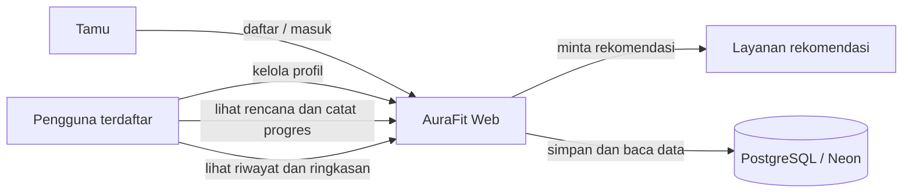
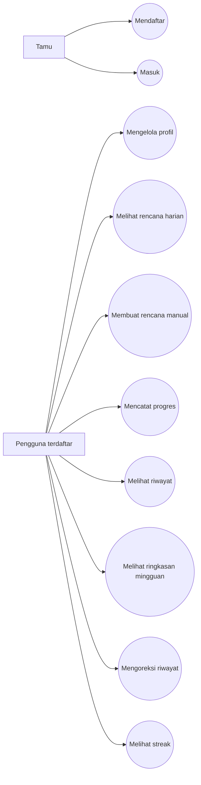
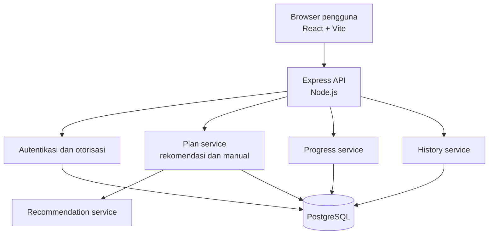
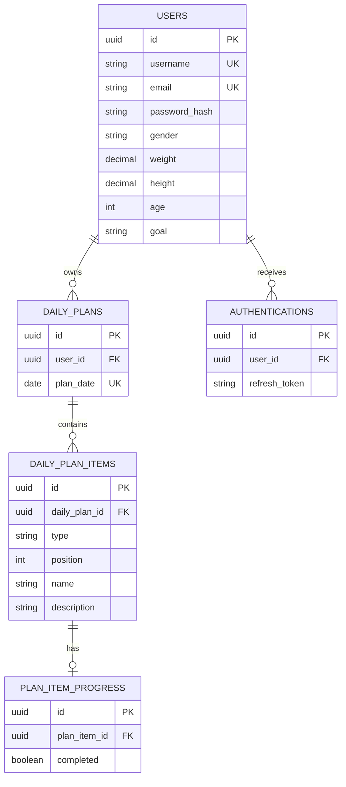
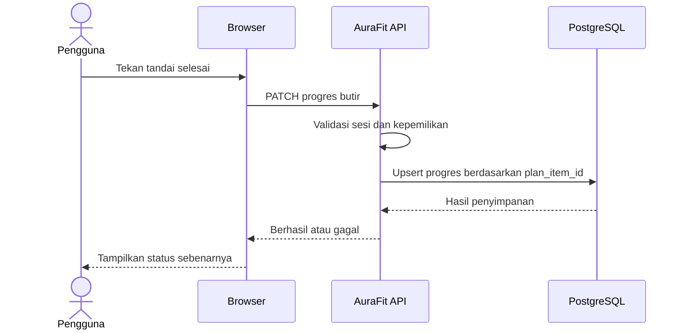
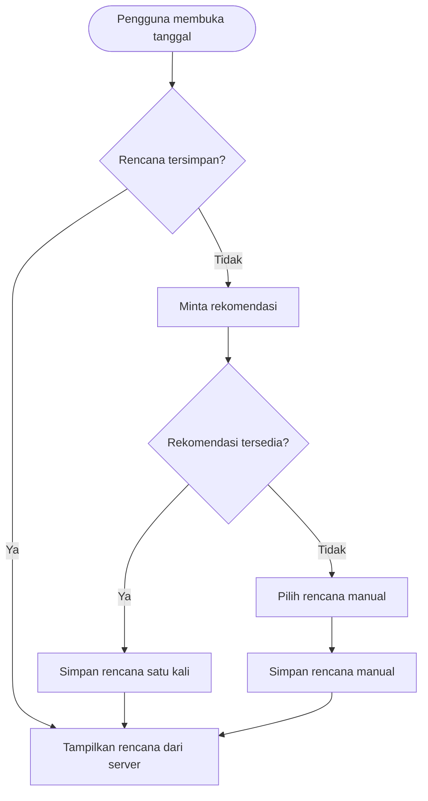

# Diagram AuraFit

Diagram berikut adalah artefak desain yang diturunkan dari SRS AuraFit versi
0.5. Mermaid dapat dirender oleh GitHub dan editor yang mendukung Mermaid.

## Batas sistem dan aktor

## Use case utama

## Arsitektur logis

## Model data

## Alur pencatatan progres

## Alur fallback rencana

## Catatan desain

- Diagram ini menggambarkan baseline desain, bukan bukti seluruh alur sudah
  diterima melalui UAT.
- Aturan tanggal, satuan, ringkasan, dan navigasi mengikuti keputusan pada
  `decision-log-aurafit.md` setelah disahkan.
- Perubahan skema atau aktor memerlukan pembaruan SRS, diagram, dan matriks
  pengujian secara bersamaan.
